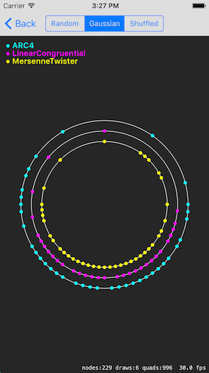
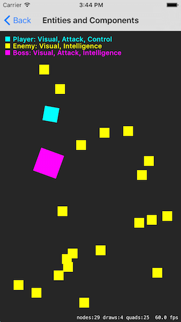
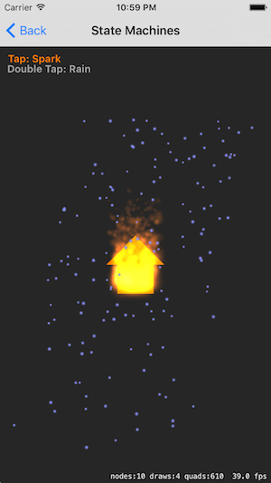
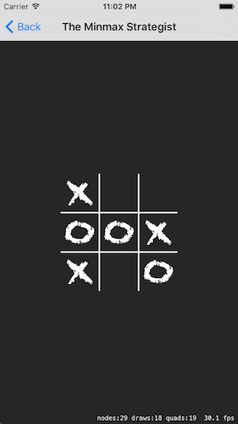
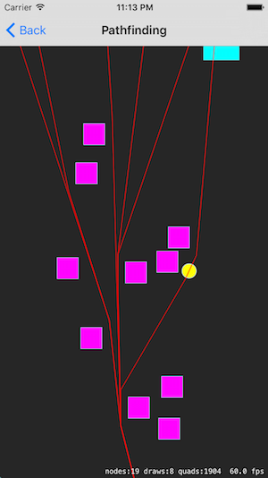
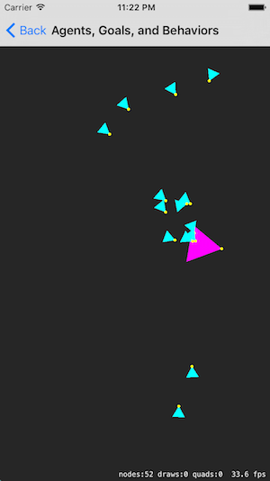
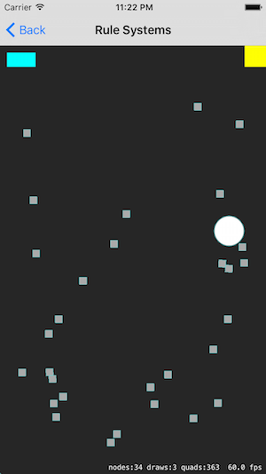
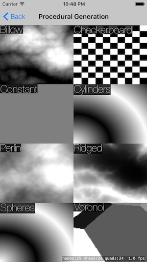

# GameplayKitSandbox

[GameplayKit](https://developer.apple.com/library/ios/documentation/General/Conceptual/GameplayKit_Guide/) examples with SpriteKit written in Swift.

Major Feature | Screenshot
--- | ---
Randomization | 
Entities and Components | 
State Machines | 
The Minmax Strategist | 
Pathfinding | 
Agents, Goals, and Behaviors | 
Rule Systems | 
Procedural Generation | 
